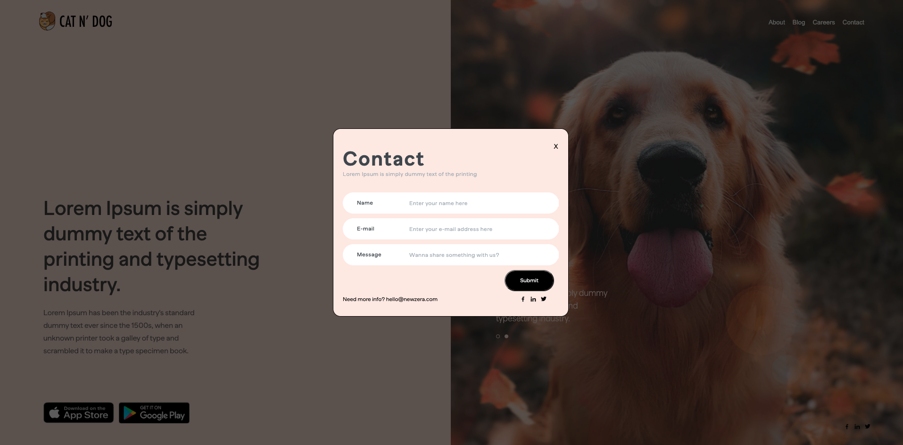

# Web App
It is a sample learning project app. 

## Added features
1. Beautiful UI of the site.
2. Responsive web design.
3. Image slider changing image every 2 sec.
4. Contact form with dull background.
5. Message written in contact form is sent using apollo client.
6. Message is recieved at server side and stored in a local mysql database.

## Reference photos

